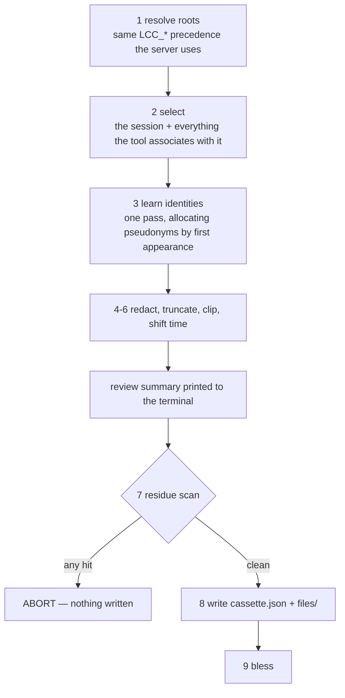

# How testing works here

A guided tour. Read this once to get oriented, then use the other docs as
reference:

| Doc | Genre | Read it when |
| --- | --- | --- |
| **this file** | tutorial | you are new, or you forgot how the pieces fit |
| `writing-tests-opencode-style.md` | style guide | you are writing a test and want the house patterns |
| `transcript-cassettes-spec.md` | design spec | you want to know *why* cassettes are built this way |
| `cassette-scenarios.md` | procedure | you are about to record a cassette |
| `opencode-testing-strategy.md` | analysis | you are deciding what layer a new test belongs in |

---

## 1. The one idea that explains the layout

This project reads transcripts written by four tools it does not control:
Claude Code, Codex CLI, Copilot CLI, and VS Code Copilot Chat. That produces
two different questions, and they need two different kinds of test data.

**"Is this branch correct?"** — does a zero-token turn render right, does a
malformed line get skipped, does the `LIVE_WINDOW` boundary fall where we say?
Answered by **synthetic fixtures**: small hand-written objects, in
`test/fixtures/`. You control every byte, so you can construct the exact edge
case. They will pass forever, including after a vendor changes their format.

**"Is this still true of what the tools actually emit?"** — did Codex rename a
field, did VS Code change its storage layout? Answered by **cassettes**:
recorded, redacted real sessions in `test/cassettes/`. You control nothing; the
recording *is* the evidence. They cannot tell you about an edge case that
didn't happen to occur during capture.

Neither replaces the other. Most tests in this repo are synthetic. The four
cassettes exist to catch the one class of bug synthetic fixtures are
structurally blind to.

---

## 2. The runners

Two runners, six suites.

```
vitest ─┬─ unit     test/unit/**        58 files   node, no DOM, no real FS
        ├─ nuxt     test/nuxt/**        27 files   mounted Vue components
        ├─ e2e      test/e2e/**          2 files   built Nitro server over HTTP
        └─ gate     test/gate/**         1 file    runs *after* e2e, reads its ledger

playwright ─┬─ browser  test/browser/**  3 files   real Chromium against pnpm preview
            └─ desktop  test/desktop/**  1 file    real Electron shell
```

Configured in `vitest.config.ts` and `playwright.config.ts`.

```sh
pnpm test:unit     # fastest loop — use this while iterating
pnpm test:nuxt     # component tests
pnpm test:e2e      # e2e + gate together (gate needs e2e's output)
pnpm test          # all four vitest projects
pnpm test:types    # nuxt typecheck + vue-tsc over test sources
pnpm test:browser  # builds, then Playwright
pnpm test:desktop  # builds, then Electron Playwright
pnpm check         # everything, in the order CI runs it
```

Two details that will otherwise confuse you:

- **The `gate` project exists because of ordering.** Each e2e spec records which
  `server/api/` routes it exercised into a ledger. `test/gate/route-coverage.spec.ts`
  reads that ledger and fails if a route went untested. It is a separate project
  with `sequence: { groupOrder: 1 }` so it cannot run before the specs that
  populate the ledger; `globalSetup` empties the ledger first.
- **Every project sets `restoreMocks`, `unstubGlobals`, `unstubEnvs`.** You do
  not need to clean those up by hand.

---

## 3. Walk one — a unit test

Unit tests must not touch the real filesystem. You get a fake one from a layer.

```ts
import { assert, describe, it } from '@effect/vitest'
import { Effect } from 'effect'
import { testFileSystem } from '../fixtures/filesystem'

describe('transcript scan', () => {
  it.effect('counts records', () =>
    Effect.gen(function*() {
      const scan = new TranscriptScan('/projects/repo/session.jsonl')
      yield* scan.refresh()

      assert.strictEqual(scan.statsAt(NOW).records, 2)
    }).pipe(Effect.provide(testFileSystem({
      '/projects/repo/session.jsonl': { content: '{...}\n{...}\n', mtime: 1_700_000_000 },
    }))))
})
```

The rules that matter:

- `it.effect` for anything touching services. `it.live` only when you genuinely
  need real time. Control time with `TestClock`, never `Date.now()`.
- `testFileSystem(tree)` from `test/fixtures/filesystem.ts` — a `FakeTree` is
  `path → string | { content, mtime }`. `mtime` is **seconds** since epoch,
  matching how the scanners report it.
- Provide stateful layers **per test**, so a cache in one case cannot leak into
  the next.
- Prefer `assert.strictEqual` / `assert.deepStrictEqual` from `@effect/vitest`.

Real filesystem coverage belongs in `test/e2e`, not here.

## 4. Walk two — a component test

```ts
import { Effect } from 'effect'
import { mountWithAtoms } from '../fixtures/mount-atoms'
import { treeResponse } from '../fixtures/runs'

const { wrapper, registry, api } = await mountWithAtoms(IndexPage, {
  api: { tree: () => Effect.succeed(treeResponse(/* … */)) },
})
```

- Build data with the `test/fixtures/runs.ts` builders (`treeResponse`,
  `runResponse`, `eventsResponse`, …). `T0`, `PROJECT_ID`, and `DEFAULT_HOURS`
  are exported so your expectations don't hardcode magic values.
- Mount through `mountWithAtoms()`. It builds a fresh registry *and* a fresh
  stub `Api` per call and provides both. A forgotten registry does not error —
  the binding falls back to a module-level singleton, and your test starts
  sharing atom state with every other mounted spec in the worker.
- Script only the endpoints your test uses. `stubApi` is `Layer.mock`, so an
  endpoint you did not script is a named defect (`lcc/Api: Unimplemented method
  "run"`) rather than a plausible default.
- Read what the page asked for with `recordedCalls(api.calls.tree)` — the query
  object, not a URL string.
- Stale-response races are gone: a superseded query is a different atom, and
  the node nobody is subscribed to is interrupted. Do not port a race test;
  assert the atom identity instead. `deferred()` survives for the one thing it
  is still good at — holding a response open to observe a pending state.
- **Assert on the composable's returned refs directly.** Do not serialize state
  into DOM attributes to read it back.
- Unmount in `afterEach` — never as the last line of a test, because a failing
  assertion above it would skip the cleanup.

---

## 5. Walk three — cassettes

This is the part that is unusual, so it gets the most space.

### 5.1 What a cassette is

A directory under `test/cassettes/<source>/<scenario>/`:

```
claude/fanout-with-subagents/
├── cassette.json                  the manifest: provenance, hashes, clock anchor, …
├── files/                         the recorded tree, in the tool's NATIVE layout
│   └── projects/<slug>/<session>.jsonl
└── expected/
    ├── parse.json                 blessed L1 result
    └── scan.json                  blessed L2 result
```

The native layout is deliberate. The cassette is not a bag of records — it is a
*filesystem shape*. That means replay exercises **discovery** (the Codex day
directory walk, Claude's `subagents/` convention, VS Code's `workspaceStorage`
layout) and not only parsing.

Two absolute rules:

1. **Never hand-edit a cassette.** They are recordings. `pnpm cassette:verify`
   checks every file against its recorded sha256 and will catch you.
2. **Blessing is explicit.** `pnpm cassette:bless` rewrites the `expected/*.json`.
   It never runs in CI. A PR that changes a blessed file must explain the change
   — *that diff is the entire point of the system*.

### 5.2 Recording one



```sh
SANDBOX=$(pnpm --silent cassette:sandbox)   # a throwaway repo with one real bug
# … run the tool against $SANDBOX, following docs/cassette-scenarios.md …
pnpm cassette:record --source claude --scenario fanout-with-subagents --session <id>
```

The recorder is plain TypeScript on `node:fs` run by bare Node with type
stripping — the repo's Effect-filesystem rule does not bind it. It lives in
`script/cassette/`:

| File | Job |
| --- | --- |
| `sources.ts` | **the descriptor table** — what the four tools are: subtree, `LCC_*` variable, default roots, producer name |
| `select.ts` | locate the session and its companions |
| `identity.ts` | allocate pseudonyms (a counter, *not* a hash — a username has too few bits to resist a dictionary attack) |
| `redact.ts` | apply the key classification, clip, drop, shift time |
| `record.ts` | the pipeline above |
| `bless.ts` | recompute `expected/*.json` |
| `verify.ts` | the gates |

Redaction is driven by `test/cassettes/redaction/`:

- `rules.ts` classifies every key into `preserve` / `pseudonymize` / `scrub` /
  `drop`. A key no table names falls through to `scrub` **and is reported** — so
  a newly added vendor field announces itself before you commit.
- `scanners.ts` holds the fail-closed residue detectors: credential shapes,
  emails, home-rooted paths, deep temp paths, the operator's own config files,
  and a Shannon-entropy backstop calibrated at 4.5 bits/char against a real
  capture.

The scanners run **twice**: in the recorder before it writes anything, and
again in `test/unit/cassette-hygiene.spec.ts` over every committed byte. The
second run is the actual guarantee — a hand-constructed cassette cannot bypass
the detectors by never going through the recorder.

### 5.3 Replaying one

Three tiers, each answering something the one below cannot.

| Tier | Spec | Runs | Asserts |
| --- | --- | --- | --- |
| **L1** conformance | `test/unit/cassette-conformance.spec.ts` | unit | every record decodes with its source's real parser, or is named in `expectedParseIssues` |
| **L2** scanner golden | `test/unit/cassette-scan.spec.ts` | unit | the full scanner output matches blessed `expected/scan.json` |
| **L3** API replay | `test/e2e/cassette-api.spec.ts` | e2e | a real Nitro server over HTTP, all cassettes in one root, against `expected/api.json` |

L1 is the cheap format-drift alarm. It is worth understanding *why* it catches
something a synthetic fixture can't: `shared/schemas/*` decode with
`onExcessProperty: 'preserve'`, on purpose, so a **renamed** vendor field does
not fail the decode — it silently produces a record that means less. A fixture
written against the old name passes forever. A recording from a newer tool
version does not.

L1 and L2 never touch disk. The loader mounts the recorded tree into the same
`testFileSystem()` fake and points each root `Context.Reference` at its subtree:

```ts
import { allCassettes } from '../fixtures/cassette'

for (const cassette of allCassettes()) {
  it.effect(`${cassette.id} projects to its blessed scan`, () =>
    Effect.gen(function*() {
      yield* TestClock.setTime(cassette.clockAnchor)
      const projection = yield* projectCassetteScan(cassette)

      assert.deepStrictEqual(
        JSON.parse(JSON.stringify(projection)),
        cassette.expected('scan'),
      )
    }).pipe(Effect.provide(cassette.layer)))
}
```

L3 is different: it writes the trees to a real temp directory with
`materializeAll(cassettes, { anchor: 'now' })`, points the `LCC_*` variables at
it, and stands up a real server. `anchor: 'now'` re-bases every mtime against
the current instant while preserving the intervals between them, so a cassette
recorded in August doesn't read as stale in December and drop out of the
freshness window.

### 5.4 Determinism, and the two rules that buy it

A golden test is worthless if it depends on when you ran it.

- **`clockAnchor`.** Every cassette is anchored to one fixed instant, and L1/L2
  pin `TestClock` to it. It is a constant rather than capture time on purpose:
  derive it from capture time and re-recording the *same* session across an hour
  boundary rewrites every timestamp, mtime, and hash — turning a one-line diff
  into a wholesale replacement that nobody reads.
- **Anything derived from "now" is an L2 assertion, never an L3 one.** `statsNow`
  reads the *server's* clock, which no test layer can reach through HTTP, so the
  L3 projection omits `ago`, `live`, and every delta built on them.

### 5.5 The blessing loop

When L2 fails, that is the system working. Read the diff:

```sh
pnpm test:unit                      # see what changed
pnpm cassette:bless                 # if the change is intended
pnpm cassette:bless:api             # only if the L3 projection also moved
git diff test/cassettes             # READ THIS — it is the signal
```

Then explain the diff in your PR description. If you cannot explain it, it is a
regression, not a blessing.

### 5.6 The gates

`pnpm cassette:verify` runs in `pnpm check` and CI:

1. **Coverage** — every source has a cassette, and at least one marked `e2e`.
2. **Hygiene** — no `.identities.local.json` decode table is tracked by git.
   (The residue scanners themselves run as a unit test, not here.)
3. **Budget and integrity** — total bytes under 2 MB, every file matches its
   recorded sha256, every file present is listed, every allowed parse issue has
   a written reason, and no cassette is marked `provenance: adhoc`.

Currently: 4 cassettes, 512 KB of the 2048 KB budget.

---

## 6. Where does my test go?

| You want to check… | Write it as | Using |
| --- | --- | --- |
| a branch, an edge case, a boundary | unit test | synthetic fixtures + `testFileSystem()` |
| an atom's cadence, cursor, or gating | unit test | `testAtoms()` + `stubApi()` + `TestClock` |
| what a component renders from an atom | nuxt test | `mountWithAtoms()` + `runs.ts` builders |
| the HTTP contract of a route | e2e test | the built server (and the route-coverage ledger picks it up) |
| that a vendor format still parses | **nothing** — L1 already does | add a cassette only if a *shape* is unrepresented |
| that the scanners still produce X | **nothing** — L2 already does | re-bless when you change them on purpose |
| something the user can see | browser test | Playwright against `pnpm preview` |
| Electron's sandboxing / CSP / nav guards | desktop test | Playwright against the real shell |

**When to add a cassette:** a supported tool ships a format change, or a
transcript shape the dashboard depends on is not represented by any recording.
Write the scenario into `docs/cassette-scenarios.md` *before* recording, and
record against the generated sandbox — never against real work.

**When not to:** for an edge case. Synthetic fixtures are the right tool, and
they always will be.

---

## 7. Things that will trip you up

- **`mtime` is in seconds**, not milliseconds, everywhere in fixtures and
  manifests.
- **`test/cassettes/redaction/` is source code**, not recordings — that is why
  `verify.ts` excludes it from the byte budget.
- **A test-only export with a `ForTest` suffix is a smell here.** If a test
  needs it, export it plainly or restructure.
- **`repos/effect/` is vendored read-only reference.** Effect v4 differs from
  everything you remember: `Context.Service`, `Schema.TaggedErrorClass`,
  `Effect.catch`. Invoke the `effect` skill before touching Effect code.
- **Adding a fifth supported tool** starts by adding one entry to
  `SOURCES` in `script/cassette/sources.ts`. TypeScript will then fail at every
  table that has no entry for it — the selector, the parser, the scanner, the
  key classification. That compile error list *is* the checklist.
