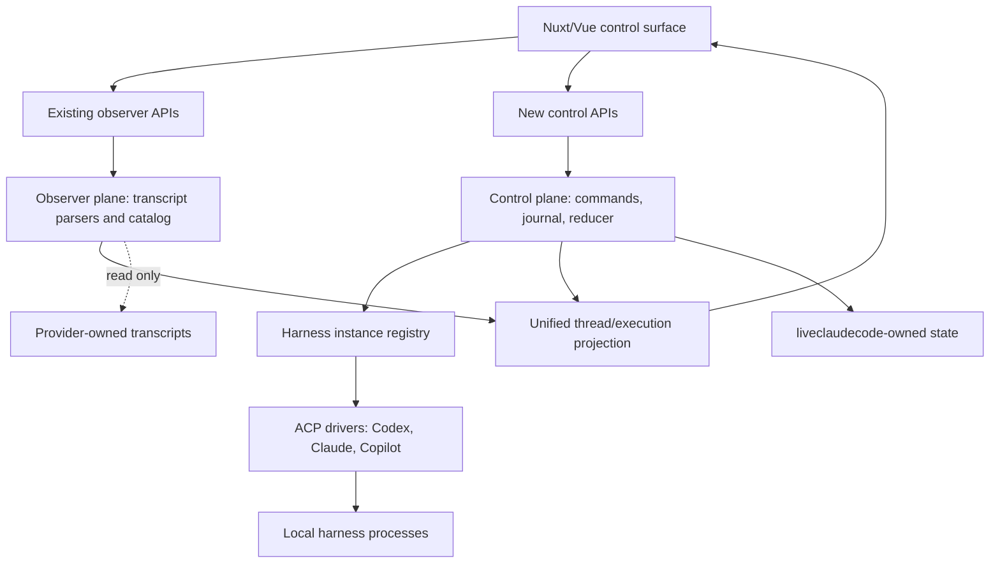

# Meta-Harness Observatory and Control Surface

## Product and technical specification

**Status:** Proposed
**Product:** liveclaudecode
**Audience:** Product, design, frontend, server, security, accessibility, QA
**Reference prototype:** [`app/pages/meta-harness.prototype.html`](app/pages/meta-harness.prototype.html), Variant A (`?variant=A`)
**Related specification:** [`docs/progressive-disclosure-workspace-spec.md`](docs/progressive-disclosure-workspace-spec.md)
**Review inputs:** Product owner, product designer, and senior developer/architect reviews

## 1. Executive summary

liveclaudecode will evolve from a provider-neutral session observer into a
local agent operations workspace. It will combine a T3 Code–style
project/thread shell and composer with liveclaudecode's deeper observability:

- recorded subagent topology;
- live activity and tool state;
- changed files and command outcomes;
- diagnostics and source health;
- token and context usage;
- estimated cost with explicit coverage; and
- safe controls for sessions the application actually owns or has verifiably
  attached to.

The product must not blur observation and control. Opening the application or
selecting a transcript never starts, resumes, interrupts, approves, stops, or
contacts an agent. A control is shown only when the selected execution has a
verified command channel and advertises that capability.

The central product object is a **thread**, representing one user task on one
primary execution in MVP. Each execution is bound to one exact harness instance
and native session. Changing harnesses creates a new visibly linked thread; it
does not pretend that one provider-native session became another provider's
session. The domain can later support explicitly delegated executions inside a
thread without changing identity.

## 2. Product thesis

Developers running multiple coding agents currently split their attention
across terminals and provider-specific applications. Existing control surfaces
make dispatch approachable, but they often do not show enough evidence to
understand the resulting work. liveclaudecode already provides that evidence
across Claude, Codex, and Copilot sessions.

The product opportunity is not merely one prompt box for many models. It is one
trustworthy place to answer:

1. What is running across my projects?
2. Which root agent or subagent needs attention?
3. Which harness instance and model own this work?
4. What did each agent do, change, consume, and cost?
5. Which actions are supported and safe from this UI?
6. How can work continue in another harness without losing provenance?

The primary promise is that a developer can answer those questions within ten
seconds of opening a thread.

## 3. Target users

### Primary

- Individual developers running several local agents or subagents.
- Technical leads monitoring parallel implementation, review, and test work.
- Advanced users comparing harness behavior, reliability, usage, and cost.

### Secondary

- Maintainers investigating transcript, adapter, or provider failures.
- Teams demonstrating or debugging agent workflows on a trusted local machine.

The MVP remains a single-user local application. Cloud administration, shared
remote control, organization billing, and multi-user collaboration require a
separate security and product model.

## 4. Jobs to be done

- When several agents are active, show the whole run and where attention is
  needed.
- When inspecting an externally started session, preserve its read-only nature.
- When starting work from liveclaudecode, make the exact project, harness
  instance, model, and permission policy explicit before execution.
- When an agent requests approval or fails, let the user inspect evidence and
  act on that request without accidentally issuing commands to siblings, while
  showing any provider-wide pause scope.
- When another harness should continue the task, create a reviewable fork with
  portable context and preserved lineage.
- When comparing work, show duration, tools, tokens, estimated cost, files, and
  diagnostics without inventing missing data.

## 5. Product principles

### 5.1 Observe by default

Starting the server, opening the browser, polling, searching, selecting a
session, or changing an observer view starts no agent process and performs no
provider-transcript write.

### 5.2 Ownership is always visible

The interface distinguishes transcript evidence from a negotiated connection
and an app-owned process. Mode is expressed with text, not color alone.

### 5.3 Control is explicit and capability-based

Controls are derived from the selected execution's negotiated capabilities.
Unsupported actions are absent or disabled with a reason. The UI never silently
downgrades a model, mode, permission profile, or required capability.

### 5.4 Evidence over inference

Unknown parentage, outcome, timing, cost, usage, or capability remains unknown.
The product does not manufacture a complete-looking graph from incomplete data.

### 5.5 Local-first remains meaningful

Passive observation requires no runtime network and emits no product telemetry.
Managed agents may contact their configured model provider; this boundary is
shown before launch.

### 5.6 Provider identity is preserved

The unified UI normalizes workflows, not provider semantics. Exact harness
instance and model remain visible wherever control or cost context matters.

### 5.7 Harness switching means forking

A provider-native session never silently changes harness. A new execution or
thread receives a bounded, reviewable context packet and visible lineage.

### 5.8 Attention is selective

Approvals, failures, disconnects, and degraded data may interrupt. Decorative
metrics and routine live updates may not steal focus or move the viewport.

### 5.9 App-owned writes are isolated

Provider transcript roots remain read-only. New metadata and event journals are
stored only in a documented liveclaudecode-owned state directory.

## 6. Goals

1. Unify observed and controlled work in one project/thread workspace.
2. Preserve Conversation, Overview, Agent map, Activity, Changes, Diagnostics,
   Costs, source health, and current filtering capabilities.
3. Make ownership mode, exact harness instance, and actionable state obvious.
4. Launch and control managed Claude, Codex, and Copilot sessions safely.
5. Display recorded and controlled agents in one evidence-backed hierarchy.
6. Attribute token usage and estimated cost at the narrowest supported level.
7. Continue work across harnesses through an explicit context fork.
8. Preserve local-only, read-only observation and provider failure isolation.
9. Meet WCAG 2.2 AA for primary workflows.

## 7. Non-goals

- Writing, renaming, truncating, or decorating provider-owned transcripts.
- Pretending an observed session is resumable when no supported control channel
  exists.
- Universal feature parity across harnesses.
- Automatically moving an in-flight native session between harnesses.
- Exact invoice reconciliation, subscription allowance inference, or
  enforcement-grade cost limits.
- Inferring hidden reasoning, missing parentage, unrelated memory, or attachment
  contents.
- Accepting arbitrary executable commands or environment variables from the
  browser.
- Providing an integrated interactive terminal/PTY, terminal splits, or
  browser-driven arbitrary command execution in MVP. Recorded command evidence
  remains available in Activity and Changes.
- Replacing provider authentication or provider-native safety controls.
- Remote companion applications, shared control, or multi-user access in MVP.
- Automatic task routing or load balancing in MVP.

## 8. Canonical terminology

| Term | Definition |
| --- | --- |
| **Project** | A normalized local working directory or repository. |
| **Thread** | The stable user-facing unit in the sidebar: one task or conversation. |
| **Harness driver** | Provider-family implementation, such as Codex, Claude, or Copilot. |
| **Harness instance** | Exact configured executable/account/profile endpoint used for control. |
| **Execution** | One attempt inside a thread, bound to one exact harness instance and native session. |
| **Native session** | Provider-owned session identity and protocol lifecycle. |
| **Agent run** | Root agent or provider-recorded subagent within an execution. |
| **Turn** | One user input and its resulting provider work. |
| **Portable context packet** | Reviewable input used to create a fork on another execution or harness. |
| **Estimated cost** | API-equivalent estimate from recorded usage, never a billing statement. |

Use **thread** for user work in the UI. Use **execution**, **native session**, and
**agent run** only when their distinction matters.

## 9. Ownership modes

Ownership mode belongs to an execution and is immutable. Attaching never
converts an Observed execution. A successful attach handshake creates a
separate Attached execution linked to the Observed execution with an
`attached-to` relation; the Observed execution remains read-only evidence.

| Mode | Definition | Lifecycle owner | Allowed behavior |
| --- | --- | --- | --- |
| **Observed** | Discovered from provider transcript storage with no verified command channel. It may still be actively written externally. | External harness or user | Inspect, filter, diagnose, and create a linked managed fork. Never send, stop, approve, interrupt, or detach. |
| **Attached** | Started outside liveclaudecode, then explicitly connected through a verified driver handshake. | External harness | Only negotiated actions. Detach ends the connection; it does not implicitly stop the runtime. |
| **Managed** | Launched by liveclaudecode through an exact harness instance. | liveclaudecode | Send, approve, interrupt, and stop according to capabilities and permission policy. |

Clarifications:

- A live transcript on disk remains Observed.
- A provider having an adapter does not make every transcript attachable.
- Unsupported attachment is unavailable; the product offers **Fork with
  context** instead.
- `execution.attach` creates a new Attached execution and never performs an
  Observed-to-Attached mode transition.
- The current Ask feature starts a separate managed ACP conversation using an
  observed transcript as context. Under the new model it creates a distinct
  Managed continuation thread with `forked-from` lineage to the Observed source;
  it is not appended inside or attached to the original session.
- **Forked from**, **delegated**, and **linked from** are relation metadata, not
  ownership modes.

## 10. Product hierarchy and graph semantics

```text
Project
├── Thread A (source task)
│   └── Primary execution (exact harness instance + native session)
│       ├── Root agent run
│       └── Provider-recorded subagent runs
└── Thread B (forked task)
    └── Primary execution (different harness instance + native session)
        └── Agent runs

Thread B --forked-from--> Thread A
```

Graph edges must declare their provenance:

| Relation | Meaning |
| --- | --- |
| `native-spawn` | Provider evidence says one agent spawned another. |
| `delegated` | liveclaudecode dispatched a related workstream. |
| `forked-from` | A context packet started an alternative or replacement execution. |
| `attached-to` | A verified control channel attached to an existing native session. |

Cross-harness work must not be labelled as a native subagent unless the
provider recorded that parentage. Unknown parentage appears under **Unlinked
agents**, not behind an invented edge.

### 10.1 Thread and execution rules

- An externally observed provider root deterministically projects to one
  synthetic thread using provider, normalized project identity, and native root
  session identity. Existing catalog deduplication rules apply before this ID
  is created.
- **Fork with context always creates a new thread.** The destination thread has
  one new Managed execution and a visible `forked-from` relation to the source.
- A future **Delegate workstream** action may create another execution inside
  the same thread; delegation is not MVP.
- A same-thread execution replacement after a crash/retry may be added later,
  but it is never implicit.
- `MetaThread.primaryExecutionId` identifies the execution used by the composer.
  In MVP every thread has one primary execution.
- If a later thread has multiple executions, the header exposes an execution
  switcher. Changing the composer target requires an explicit selection and
  confirmation; selecting a map node never changes it.
- For a multi-execution thread, the sidebar displays **Mixed harnesses**,
  aggregates unique agent counts and cost with coverage, and derives thread
  attention by this precedence: approval/blocked, failed, running, stale,
  completed, stopped, unknown. Detail disclosure lists each execution rather
  than hiding the aggregation.

## 11. MVP scope

### 11.1 Supported harnesses

- Claude, Codex, and Copilot are supported for observation as today.
- MVP control uses one exact default instance per supported harness through the
  existing ACP foundation.
- Release eligibility for each Managed harness is conformance-tested. Claude,
  Codex, and Copilot must each support start, prompt, output/tool streaming,
  safe turn cancellation, process stop, and either user-mediated approvals or
  an enforceable read-only mode. A harness failing this minimum remains
  Observed-only and cannot be advertised as MVP control support.
- The domain model and contracts use exact instance IDs from the first slice so
  multiple instances do not require an identity migration.
- Multiple user-configured instances/accounts are P1.
- OpenCode control is not an MVP commitment.
- Attached mode exists in the domain model but ships per harness only after a
  genuine attach/reconnect contract is proven.

Release-blocking Managed capability matrix:

| Harness | Start/prompt/stream | Safe interrupt and stop | Permission eligibility | MVP release status |
| --- | --- | --- | --- | --- |
| Codex | Required and driver-conformance tested | Required | Supervised approvals or enforced read-only | Managed only after passing |
| Claude | Required and driver-conformance tested | Required | Supervised approvals or enforced read-only | Managed only after passing |
| Copilot | Required and driver-conformance tested | Required | Supervised approvals or enforced read-only | Managed only after passing |

The release notes list the tested capabilities of each shipped version. MVP
release is blocked until all three rows pass. During internal development a
failing row remains Observed-only, and the UI never presents a partially safe
driver as controllable.

### 11.2 Control enablement

- Passive observation remains the default launcher behavior.
- State-changing control surfaces require an explicit `--control` launcher
  option.
- Mutation is hard-disabled when the server binds to a non-loopback host.
  Remote control is future scope and has no MVP override.
- The existing `/api/chat` Ask path must be migrated behind the same control
  gate, mutation authentication, command journal, and user-mediated permission
  flow before release. Its current unconditional full-access behavior is not
  available in observer mode. Until migrated, Ask is removed or disabled when
  `--control` is absent.

### 11.3 MVP capabilities

1. Read-only harness inventory and readiness.
2. Explicit Observed/Attached/Managed labels.
3. Create a Managed thread after a launch review.
4. Select project/cwd, exact instance, model, reasoning/mode where supported,
   permission profile, and existing-checkout or isolated-worktree workspace
   mode.
5. Send turns and stream text, thought, and tool updates.
6. Interrupt the current turn and stop a Managed execution.
7. Surface approval requests with allow-once and deny decisions.
8. Preserve all five primary investigation views plus Overview and Costs.
9. Display mixed-harness execution and agent relations in the map.
10. Display usage and estimated cost with coverage and provenance.
11. Fork an Observed or Managed execution into a new Managed execution after
    previewing a bounded context packet.
12. Persist liveclaudecode-owned thread metadata and canonical event history.
13. Reconcile Managed executions with their later-discovered provider
    transcripts without duplicate threads.
14. Delete liveclaudecode-owned thread history and context on explicit request.
15. Present structured harness questions separately from permission approvals.
16. Enforce negotiated composer limits and explicit active-session model-change
    semantics.

MVP permission profiles are:

- **Supervised:** permission requests remain pending for allow-once or deny.
- **Read-only:** available only when the driver can enforce it.

MVP has no preauthorized full-access or persistent-approval profile. A driver
that can neither surface approvals nor enforce read-only behavior is ineligible
for Managed MVP support.

### 11.4 Later scope

- Multiple configured instances and accounts per harness.
- Verified attach/reconnect where providers support it.
- Persistent or policy-based approvals.
- Automatic dispatch/load balancing.
- Budgets, alerts, scheduled tasks, and reusable multi-agent templates.
- Direct arbitrary subagent messaging.
- Comparative reports, cost forecasting, and benchmarking.
- Turn-scoped checkpoints, historical diffs, and coordinated workspace plus
  provider-conversation revert. Checkpoint completion is independent of turn
  completion and must never make a failed snapshot look successful.
- Guarded source-control actions such as commit, pull, push, publish, and create
  pull request, with dirty/behind/diverged/detached/default-branch protections.
- Proposed-plan artifacts with provenance and explicit Refine, Implement, or
  Start linked thread actions.
- Remote or multi-user control under a separate security model.

## 12. Business requirements

| ID | Requirement |
| --- | --- |
| BR-01 | Opening or using observer functionality must never start an agent or modify provider-owned data. |
| BR-02 | Every control-capable execution must expose ownership mode and exact harness instance in accessible text. |
| BR-03 | One UI must browse, inspect, and—when authorized—control supported harnesses without hiding provider differences. |
| BR-04 | Every visible control must map to a negotiated capability of the exact target execution. |
| BR-05 | Missing, unsupported, partial, estimated, and recorded data must remain distinguishable. |
| BR-06 | Changing harnesses must create a visible fork with reviewable context and preserved lineage. |
| BR-07 | Failures in one transcript source, harness instance, or execution must not hide healthy sources. |
| BR-08 | Existing observer workflows and synthetic transcript coverage must remain compatible. |
| BR-09 | Managed launch must disclose project, harness, model, permission, file, command, credential, and network implications before execution. |
| BR-10 | Observer, catalog, persistence, and control-plane code must never directly write, rename, truncate, or decorate provider transcript stores. A launched provider may write its own native transcript. |
| BR-11 | Monetary values must be labelled estimated and expose priced/unpriced coverage. |
| BR-12 | The product must remain useful with telemetry disabled and runtime network blocked for observer-only use. |
| BR-13 | Current Ask cannot remain an unconditional full-access exception; it must use the Managed control gate and permission contract or be disabled. |
| BR-14 | Users must be able to delete all thread-owned liveclaudecode journals, snapshots, drafts, and context packets without deleting provider transcripts or project files. |

## 13. Core user journeys

### 13.1 Browse and inspect

1. User opens liveclaudecode without `--control`.
2. Sidebar groups Observed threads by project and shows provider, mode, live or
   attention state, and recorded child count.
3. Opening a thread starts no process.
4. The user moves among Overview, Conversation, Agent map, Activity, Changes,
   and Diagnostics without losing per-thread view state.

### 13.2 Create a Managed thread

1. User launches with `--control` and selects **New thread**.
2. User chooses project, exact ready harness instance, model/mode options,
   permission profile, and workspace mode: **Dedicated worktree** (recommended
   for Git projects) or **Existing checkout**.
3. For a dedicated worktree, the user selects a base branch and may edit the
   generated branch name. The review shows the resolved worktree path and any
   project-configured setup routine, including whether it may use the network.
   The browser never supplies a raw setup command.
4. Preflight checks repository state, path/branch collisions, instance capacity,
   and whether an existing checkout is dirty or shared by another Managed run.
5. Launch review always shows cwd/worktree, exact instance/model, permission profile,
   and the process/network warning. Executable, credential, file, command, and
   capability detail is available in labelled disclosures.
6. An explicitly initiated active preflight reports auth/protocol capabilities
   and unsupported combinations. Merely opening inventory never starts an
   adapter to discover them.
7. User explicitly confirms. For dedicated mode, the worktree is prepared and
   its exact path, base, and branch are persisted before the agent starts.
8. A successful preparation creates exactly one thread and execution and sends
   the first turn.
9. Cancel or preflight failure starts no process. Setup failure creates no agent,
   reports a recoverable **Setup failed** state, and offers retry or safe cleanup;
   liveclaudecode never silently deletes a worktree containing user changes.

### 13.3 Follow up

1. Composer displays the owning execution target adjacent to the send action.
2. Selecting a subagent changes inspection context only.
3. Sending a normal follow-up targets the thread-owning execution.
4. Direct subagent messaging appears only when explicitly advertised.

### 13.4 Resolve attention

1. A waiting or failed agent is emphasized in the sidebar, map, and
   Diagnostics.
2. Selecting it opens the contextual inspector with reason and evidence.
3. An approval shows requesting agent, harness instance, operation, target,
   cwd, scope, expiry, and available choices.
4. Allow once or deny is scoped to that request. liveclaudecode issues no
   command to siblings, but the UI displays the provider-reported pause scope;
   a provider may pause the entire native execution while waiting.

### 13.5 Fork to another harness

1. User selects **Fork with context**.
2. UI previews destination instance/model/capabilities and the context packet.
3. User can remove optional file, diff, plan, or diagnostic context.
4. No permission escalation or capability downgrade occurs silently.
5. Confirming always creates a distinct Managed thread and execution with
   visible lineage; the source remains intact.

### 13.6 Delete local history

1. User selects **Delete local thread history** from thread settings.
2. UI lists the app-owned journals, snapshots, drafts, and context packets that
   will be removed and states that provider transcripts/project files remain.
3. A live Managed execution must be stopped first through a separate confirmed
   action.
4. Confirmation removes all data owned exclusively by that thread. Shared
   harness configuration remains.
5. If an Observed source still exists, it may project again as an Observed
   thread on the next catalog scan; this is explained before deletion.

### 13.7 Recover after failure or restart

1. Last good observer data remains visible and receives a stale timestamp.
2. Provider or process failure produces a typed diagnostic.
3. On restart, a Managed execution is reattached only when verified safe.
4. Otherwise it becomes Disconnected or Unknown, never falsely Running or
   Completed.

## 14. Information architecture

### 14.1 Persistent shell

The approved visual direction is Variant A of the prototype:

```text
+----------------------+------------------------------------------------+------------------+
| Project/thread       | Thread header and actions                      | Contextual       |
| sidebar              +------------------------------------------------+ inspector        |
|                      | Conversation / Agent map / Activity /          | optional         |
| provider, mode,      | Changes / Diagnostics                          |                  |
| status, attention    +------------------------------------------------+ agent, event,    |
|                      | Run totals                                     | file, incident   |
|                      +------------------------------------------------+ or approval       |
|                      | Primary workspace                              |                  |
|                      +------------------------------------------------+                  |
|                      | Targeted composer                              |                  |
+----------------------+------------------------------------------------+------------------+
```

### 14.2 Sidebar

Each thread row exposes, when available:

- title and project;
- provider and exact instance on disclosure;
- Observed, Attached, or Managed mode;
- running, waiting, blocked, failed, completed, stopped, stale, or unknown;
- direct/total agent count; and
- latest meaningful activity time.

Search and filters include project, provider, mode, status, and attention.

### 14.3 Header and run totals

Header hierarchy is:

1. Thread title.
2. Project/branch, ownership mode, harness instance, and model when known.
3. Capability-driven actions.

The compact totals strip may show state, live/total agents, estimated cost and
coverage, tokens, elapsed time, and changed files. It must show `—`, **Not
recorded**, or **Unpriced** instead of rendering missing values as zero.

### 14.4 Primary workspaces

- **Overview:** calm default summary defined by the existing progressive
  disclosure specification.
- **Conversation:** recorded evidence is grouped and labelled by execution.
  Observed native transcript content and Managed continuation content are never
  interleaved as if they came from one native session. An Observed execution
  without a Managed continuation has no composer; it offers **Start managed
  continuation** instead.
- **Agent map:** hierarchy and execution relations.
- **Activity:** chronological session-wide event stream.
- **Changes:** files, commands, patches, and git events.
- **Diagnostics:** failures, warnings, timing, context pressure, and source
  limitations.
- **Costs:** fleet-level date/model/harness analysis remains a separate route;
  thread and agent cost appears contextually.

Default behavior:

- Observed threads open Overview unless a per-thread last view is available.
- Newly created Managed threads open Conversation.
- View changes preserve composer draft, map viewport, filters, scroll, and
  eligible inspector selection.

### 14.5 Contextual inspector

The inspector is selection context, not a second navigation system. Content
order is:

1. Urgent state and action.
2. Summary.
3. Activity, incidents, files, and result.
4. Usage and attributable estimated cost.
5. Technical identity and provenance.
6. Destructive actions, visually separated.

Selecting a different agent updates the open inspector without changing the
thread or silently retargeting the composer.

### 14.6 Composer

- Shows exact target instance and model.
- Shows model, effort/mode, and permission selectors only when negotiated.
- Remains bound to the owning execution unless the user enters an explicit
  fork/delegation flow.
- Displays blocked, disconnected, unsupported, or waiting state adjacent to
  send.
- Draft is owned by thread and survives workspace/panel changes.
- Uses a negotiated `ComposerInputLimits` contract covering maximum text
  characters and bytes, attachment count, per-item and total attachment bytes,
  accepted image MIME types, and provider-specific image dimensions where
  relevant. Validation happens before send and names the violated limit; input
  is never silently truncated or dropped.
- Supports paste/drop image previews only when the target advertises image
  input. Any local compression is disclosed, and every attachment can be
  inspected or removed before send.
- Resolves `@` file mentions from a project/worktree index, displays the exact
  selected path, refreshes the index after recorded file changes, and reports a
  stale or missing reference. A mention does not imply embedding file contents
  unless the target capability says it does.
- Offers only driver-advertised slash commands, labelled by provider. Slash
  commands are structured harness actions, never a raw shell escape hatch.
- Persists one immutable draft record per thread in app-owned state and removes
  it with `thread.delete`.
- Applies model changes according to the active execution's declared semantics;
  a selector value is never accepted and then ignored.

## 15. Agent map requirements

### 15.1 Node content

Default nodes show:

- role/name;
- provider and exact instance;
- model when recorded;
- state using icon/text plus color;
- current tool or task;
- elapsed time; and
- child or hidden-child count.

Tokens, estimated cost, files, and incidents are switchable overlays. The
prototype intentionally shows all metrics to demonstrate availability;
production nodes default to a calmer density.

### 15.2 Interaction

- Click selects and opens the inspector.
- Enter or double-click focuses a branch.
- Escape clears focus or returns to the previous scope.
- Keyboard traversal follows the semantic hierarchy.
- Search, fit, zoom, pan, minimap, horizontal/vertical layout, branch collapse,
  lenses, and replay/time marker remain available.
- Polling must not reset viewport, selection, collapsed branches, or search.
- Native spawn and fork/delegation edges have different styles and accessible
  descriptions.
- A selected child exposes a targeted interrupt only when the execution
  advertises `interruptSelectedAgent`. Otherwise the control is labelled
  **Interrupt execution**, names the affected root execution, and never implies
  child-only scope. Stop always names and targets an execution.

### 15.3 Dense graphs

- Beyond the existing dense-graph threshold, summarized branch/workstream nodes
  show hidden counts and reveal children on demand.
- A 100-agent synthetic fixture must remain usable.
- Unknown parentage appears under **Unlinked agents**.
- Mobile defaults to a semantic hierarchy list with **Open canvas** as an
  explicit full-screen action.

The performance fixture is a balanced 100-agent graph with 2,500 canonical
events, mixed statuses, 20 changed files, and four collapsed branches. Measure
a production build in Playwright Chromium on an Apple M1/16 GB reference machine
or documented CI equivalent after the server is warm but browser state is cold.
From thread-snapshot receipt to keyboard-interactive semantic list/map must be
under two seconds; agent selection response must remain under 100 ms at p95 over
50 selections. Polling may not reset viewport or selection.

### 15.4 Accessible alternative

Every canvas graph has an equivalent semantic tree or structured list. Canvas
geometry is an enhancement, not the only way to obtain relationships, state,
metrics, or actions.

The semantic representation uses the ARIA tree pattern:

- Up/Down moves to the previous/next visible node.
- Left collapses an expanded node or moves to its parent.
- Right expands a collapsed node or moves to its first child.
- Home/End moves to the first/last visible node.
- Enter selects and opens the inspector; Space toggles selection without
  changing composer target.
- Canvas and tree share one selected agent identity. Moving focus in one does
  not unexpectedly move focus in the other.

## 16. Cost and usage requirements

### 16.1 Wording and truthfulness

- Use **Estimated API-equivalent cost**, not Spend or Bill.
- Display pricing basis/version, last rate update, priced request count,
  unpriced request count, and coverage.
- Do not infer subscription allowances, credits, or actual invoice amounts.
- Distinguish `$0.00`, Unknown, Not recorded, and Unpriced.

### 16.2 Attribution

- Attribute at thread, execution, agent, harness, and model levels only where
  source evidence supports it.
- Never distribute an unassigned session total across agents by guesswork.
- Deduplicate replayed or cumulative provider samples with stable sample IDs.
- Prevent parent/subagent double counting.
- Explain input, output, cache-read, and cache-write contributions.

### 16.3 Canonical sample

```ts
interface CostRecord {
  readonly amountUsd: number | null
  readonly basis: 'reported' | 'estimated' | 'unknown'
  readonly pricingVersion: string | null
  readonly pricedAt: string | null
  readonly pricedRequests: number
  readonly unpricedRequests: number
  readonly usage: Usage
  readonly provider: SessionSource
  readonly model: string
  readonly executionId?: ExecutionId
  readonly agentRunId?: AgentRunId
  readonly sampleId: string
}
```

The implementation builds on `server/utils/cost.ts`, `CostUsageSample`,
`RunDiagnostics.cost`, and the existing Costs route. Historical records retain
the pricing version used so a rate-table change does not silently rewrite old
totals. When the provider does not supply a stable sample identity, the server
derives one deterministically from canonical execution/agent identity,
provider-native references, usage fields, and event position.

## 17. Responsive behavior

### 17.1 Large desktop: 1280 px and above

- Three-pane layout.
- Resizable/collapsible sidebar and inspector.
- Primary workspace keeps at least 640 px when the inspector is docked.

### 17.2 Medium: 768–1279 px

- Sidebar plus primary workspace.
- Inspector becomes a modal slideover and restores focus on close.
- Header actions collapse progressively.

### 17.3 Small: below 768 px

- Project list becomes a drawer.
- Header actions move into a labelled menu.
- Totals reflow into a two/three-column grid or scoped horizontal region.
- Composer controls disclose progressively.
- Inspector becomes a full-height sheet.
- Agent hierarchy list is default; canvas is an explicit full-screen mode.
- Touch targets are at least 44×44 CSS px on coarse pointers.

No primary action may depend on hover. Fixed canvas offsets may not assume
desktop pane widths.

## 18. Accessibility requirements

- Target WCAG 2.2 AA.
- Body text contrast is at least 4.5:1; large text and UI graphics are at least
  3:1.
- Status uses icon/text in addition to color.
- Icon-only controls have accessible names.
- Focus is visible on every theme and surface.
- Sidebar, tabs, map/list, inspector, dialogs, approval flow, and composer are
  fully keyboard operable.
- Shortcuts are ignored while typing or composing text and are discoverable.
- Modal layers trap focus and return it to the invoker.
- Live announcements are coalesced and do not announce the whole activity feed.
- Approvals/errors use assertive announcements only when immediate action is
  genuinely required.
- Reduced-motion mode disables nonessential pulse, pan, and transition motion.
- The UI supports 400% zoom and 320 CSS px without page-level two-dimensional
  scrolling. The canvas may pan inside its own labelled region.
- Automated scans are supplemented by keyboard-only browser journeys.

## 19. Required product states

The implementation must represent:

- first run/no sessions;
- no filter results;
- missing project or transcript;
- Observed-only thread;
- control disabled;
- no harness configured;
- unavailable binary, credentials, or incompatible version;
- unsupported capability or option combination;
- initial loading and incremental refresh;
- stale last-good data;
- degraded source while other sources remain healthy;
- malformed/partial transcript;
- disconnected or crashed native session;
- no recorded tokens, cost, files, agents, or diagnostics;
- pending, expired, already-resolved, and failed approval;
- command queued, accepted, succeeded, rejected, timed out, or conflicted;
- fork preflight failure or partial context;
- process capacity reached; and
- restart with an unverifiable former Managed process.

Refresh failure must not blank the last good view. Source-local failure must not
hide healthy harnesses.

Minimum presentation and recovery rules:

- Initial load uses workspace-aligned skeletons and never flashes zero values.
- Incremental refresh preserves content in place.
- Stale data shows one persistent banner with last-success timestamp, Retry,
  and Details.
- Empty states explain why they are empty and offer one relevant remediation.
- Disabled capability controls expose a persistent textual reason, not only a
  tooltip.
- A disconnected composer preserves its draft, disables Send, identifies the
  execution, and offers Retry/Reconnect only when capability permits.
- An expired or already-resolved approval is replaced with its terminal state;
  stale decision buttons disappear.
- A partial context packet warning lists omitted/truncated fields and blocks
  dispatch only when required context or destination limits are violated.
- On Observed runs, a missing exact instance is displayed as **Instance not
  recorded**, not as an unhealthy Unknown instance.

## 20. Technical architecture

### 20.1 Overview



The observer plane remains independently useful and read-only. The control
plane owns only liveclaudecode-launched or verifiably attached executions. A
projection reconciles control identities with later-discovered transcripts.

### 20.2 Repository boundaries

- `app/**` remains plain TypeScript/Vue. Do not introduce Effect into
  components or composables.
- `shared/schemas/**` owns Effect `Schema` contracts for commands, events, IDs,
  settings, and external data.
- `shared/types/**` exposes derived or plain client/server contracts.
- `server/api/**` remains thin: request extraction, Effect execution, response.
- `server/utils/**` owns drivers, registry, orchestration, persistence,
  projection, and domain decisions.
- Services and state are provided with `Layer`; no module-level mutable control
  state or test-only dependency parameters.
- Server domain code uses Effect filesystem and clock abstractions.
- Typed failures use `Schema.TaggedErrorClass`; `server/utils/runtime.ts` keeps
  exhaustive HTTP mapping.
- Before implementing Effect code, follow `repos/effect/LLMS.md` and the
  repository's Effect v4 sources.

## 21. Domain identities and entities

IDs are opaque, branded, and schema-validated. Display names never route work.

| ID | Purpose |
| --- | --- |
| `ProjectId` | Existing normalized absolute path or Unassigned identity. |
| `MetaThreadId` | Stable liveclaudecode thread. |
| `HarnessInstanceId` | Exact configured harness endpoint. |
| `ExecutionId` | One attempt on one instance. |
| `NativeSessionId` | Provider-native identity, stored as provenance. |
| `AgentRunId` | Execution-scoped canonical agent identity. |
| `TurnId` | Canonical turn identity. |
| `CommandId` | Client-generated idempotency key. |
| `EventId` | Journal event identity/sequence. |
| `ApprovalId` | Canonical approval mapped to a native request ID. |
| `UserInputRequestId` | Canonical structured-question request mapped to a native request ID. |
| `ContextPacketId` | Immutable fork input identity. |

Existing `RunNode.key` remains for observer compatibility but is provider- and
project-scoped. It must not become a control-plane execution ID.

Principal entities are:

- `MetaThread` — title, project, timestamps, primary execution, lineage.
- `Execution` — thread, instance, mode, native session, state, capability
  snapshot, workspace binding, model, and permission configuration.
- `WorkspaceBinding` — existing-checkout or dedicated-worktree mode, exact cwd
  or worktree path, base/branch provenance, and setup state.
- `AgentRun` — execution, native identity, recorded parent, state, usage, and
  diagnostics.
- `ExecutionRelation` — source, target, relation kind, and provenance.
- `PendingApproval` — request summary, choices, state, and expiry.
- `PendingUserInput` — one or more typed questions, allowed answers, state, and
  expiry; it carries no permission authority and is not an approval.
- `PortableContextPacket` — previewable fork input and source references.
- `CanonicalEvent` — append-only control-plane fact.

## 22. Harness driver and instance registry

### 22.1 Driver contract

The driver contract is narrow and has no arbitrary raw-RPC escape hatch:

```ts
interface HarnessDriver<DriverError> {
  readonly kind: HarnessDriverKind
  readonly probe: (
    instance: HarnessInstanceConfig,
  ) => Effect.Effect<HarnessInstanceSnapshot, DriverError>
  readonly startExecution: (
    input: StartExecutionInput,
  ) => Effect.Effect<HarnessSession, DriverError, Scope.Scope>
  readonly attachExecution?: (
    input: AttachExecutionInput,
  ) => Effect.Effect<HarnessSession, DriverError, Scope.Scope>
  readonly sendTurn: (input: SendTurnInput) => Effect.Effect<TurnReceipt, DriverError>
  readonly interruptTurn: (input: InterruptTurnInput) => Effect.Effect<void, DriverError>
  readonly resolveApproval: (
    input: ResolveApprovalInput,
  ) => Effect.Effect<void, DriverError>
  readonly respondToUserInput: (
    input: RespondToUserInputInput,
  ) => Effect.Effect<void, DriverError>
  readonly setSessionModel?: (
    input: SetSessionModelInput,
  ) => Effect.Effect<void, DriverError>
  readonly stopExecution: (executionId: ExecutionId) => Effect.Effect<void, DriverError>
  readonly events: (executionId: ExecutionId) => Stream.Stream<HarnessRuntimeEvent>
}
```

The exact Effect environment is implementation-specific and supplied through
Layers. Driver translation is separate from ACP transport.

### 22.2 Registry responsibilities

`HarnessRegistry` owns:

- validated exact-instance configuration;
- allowed launch commands and fixed environment overlays;
- readiness, auth, version, capability, and capacity snapshots;
- driver lookup by exact instance ID;
- scoped process/session ownership and teardown; and
- reconciliation of live instances after settings changes.

For every Managed execution, the registry creates and retains a
`Scope.Closeable`, provides that scope to `startExecution`, and stores the
returned session handle. It closes the scope on explicit stop, eviction,
service shutdown, or failed creation. A driver is never allocated in an HTTP
request scope.

Browser input never supplies a raw executable or environment.

### 22.3 ACP reuse and required changes

`server/utils/acp-connection.ts` is the initial transport foundation. It already
provides scoped child processes, JSON-RPC correlation, queued updates, and
failure propagation. The control plane additionally requires:

- parsed initialization capabilities;
- pending asynchronous permission decisions;
- process/session lifecycle events;
- raw unknown update preservation as diagnostics; and
- provider-specific translation outside the transport.

The existing synchronous permission callback and Ask's unconditional approval
policy cannot back the new control flow.

## 23. Capabilities

Capabilities are versioned and instance/session-specific, not a single
full-access boolean.

```ts
interface HarnessCapabilities {
  readonly version: number
  readonly lifecycle: {
    readonly start: boolean
    readonly attach: boolean
    readonly resume: boolean
    readonly stop: boolean
  }
  readonly turn: {
    readonly prompt: boolean
    readonly interrupt: boolean
    readonly interruptSelectedAgent: boolean
    readonly promptSelectedAgent: boolean
  }
  readonly configuration: {
    readonly sessionModelSwitch: 'in-session' | 'new-thread' | 'unsupported'
  }
  readonly approvals: {
    readonly surface: boolean
    readonly allowOnce: boolean
    readonly allowAlways: boolean
    readonly denyOnce: boolean
    readonly denyAlways: boolean
  }
  readonly input: {
    readonly text: boolean
    readonly fileReferences: boolean
    readonly images: boolean
    readonly contextPacket: boolean
    readonly slashCommands: boolean
    readonly structuredUserInput: {
      readonly freeText: boolean
      readonly singleSelect: boolean
      readonly multiSelect: boolean
    }
    readonly limits: {
      readonly maximumTextCharacters?: number
      readonly maximumTextBytes: number
      readonly maximumAttachments: number
      readonly maximumAttachmentBytes: number
      readonly maximumTotalAttachmentBytes: number
      readonly acceptedImageMimeTypes: readonly string[]
    }
  }
  readonly observation: {
    readonly textDeltas: boolean
    readonly thoughtDeltas: boolean
    readonly tools: boolean
    readonly nativeSubagents: boolean
    readonly usage: boolean
    readonly changedFiles: boolean
  }
  readonly limits: {
    readonly concurrentExecutions: number
  }
}
```

Model, effort, interaction mode, and permission choices are separate capability
descriptors with stable values and labels.

Rules:

- Probe instance capabilities before creation.
- Snapshot negotiated capabilities on the execution.
- Capability change emits an event and may degrade the execution.
- A model chosen before start is part of creation configuration. During an
  active native session, `in-session` applies the new model to subsequent turns
  in that session and emits `execution.model-changed`; `new-thread` opens an
  explicit fork flow; `unsupported` disables the selector with a reason.
- Structured user input is an informational response channel. It cannot grant
  tool, file, command, credential, or network permission and never resolves an
  approval implicitly.
- Input limits and advertised slash commands are snapped with the execution and
  revalidated server-side on every turn.
- Explicit user instance choice wins.
- Any future automatic routing chooses only a ready instance supporting every
  required capability.
- Fork is an orchestration capability derived from destination `start` plus
  accepted context input; it is not a native driver lifecycle capability.

## 24. Canonical commands

New command schemas live in `shared/schemas/control.ts` as an Effect `Schema`
discriminated union. Client types derive from the schema.

Required commands:

- `thread.create`
- `execution.start`
- `execution.attach`
- `execution.fork`
- `turn.start`
- `turn.interrupt`
- `approval.resolve`
- `user-input.respond`
- `execution.model.set`
- `execution.stop`
- `thread.rename`
- `thread.archive`
- `thread.delete`

`execution.fork` is named for its source but atomically creates a new
`MetaThread`, destination execution, immutable context packet, and lineage
relation. It never appends a cross-harness execution to the source thread.

Every command envelope contains:

- `commandId` generated by the client;
- expected thread/execution revision where relevant;
- target IDs;
- validated payload; and
- client timestamp for diagnostics only, never ordering.

The journal durably records `command.accepted` before invoking an external side
effect. A duplicate `commandId` returns the recorded acknowledgement and is not
deliberately executed twice. If the host crashes after the external side effect
but before its terminal event, the command becomes **Unknown** and requires
driver reconciliation; the server never blindly replays it. This is an
idempotent retry contract, not an impossible exactly-once guarantee across
process crashes.

`thread.delete` is the deliberate privacy exception to retained command
receipts. It records acceptance and `thread.deleted`, closes live resources,
atomically renames the per-thread state directory into a deletion-staging path,
and recursively removes that staged directory. After removal, repeating delete
for the same valid thread ID returns the deterministic terminal result
**Already absent** without requiring a retained private receipt. Other commands
against an absent thread still return `UnknownThread`.

`turn.interrupt` targets an execution by default. An optional `agentRunId` is
valid only when `interruptSelectedAgent` was negotiated; otherwise validation
rejects it as unsupported.

`user-input.respond` contains the request ID and answers keyed by stable
question ID. The schema validates cardinality and allowed choices, supports
sequential multi-question flows, and cannot encode a permission decision.

`execution.model.set` is accepted only for an active execution advertising
`sessionModelSwitch: 'in-session'`. A `new-thread` capability starts the
existing fork journey instead of mutating the current execution.

## 25. Canonical events and projection

### 25.1 Event envelope

```ts
interface CanonicalEventEnvelope {
  readonly eventId: EventId
  readonly sequence: number
  readonly revision: number
  readonly timestamp: string
  readonly threadId: MetaThreadId
  readonly executionId?: ExecutionId
  readonly agentRunId?: AgentRunId
  readonly harnessInstanceId?: HarnessInstanceId
  readonly causedByCommandId?: CommandId
  readonly nativeReference?: SanitizedNativeReference
  readonly payload: CanonicalEventPayload
}
```

Required payload families:

- `command.accepted`, `command.succeeded`, `command.rejected`,
  `command.timed-out`, `command.conflicted`, `command.unknown`;
- `thread.created`, `thread.renamed`, `thread.archived`, `thread.deleted`;
- `execution.created`, `execution.attached`, `execution.state-changed`,
  `execution.model-changed`, `execution.ended`, `execution.crashed`;
- `workspace.preparing`, `workspace.prepared`, `workspace.setup-failed`;
- `turn.started`, `turn.ended`, `turn.interrupted`;
- `output.delta`, `thought.delta`;
- `tool.started`, `tool.updated`, `tool.ended`;
- `agent.discovered`, `agent.state-changed`, `agent.ended`;
- `approval.requested`, `approval.resolved`, `approval.expired`;
- `user-input.requested`, `user-input.resolved`, `user-input.expired`;
- `usage.recorded`, `cost.updated`;
- `file.changed`, `diagnostic.raised`;
- `capabilities.changed`; and
- `command.rejected`.

Pending user input and pending approval project to separate attention kinds,
use different actions, and may coexist. A provider question such as choosing an
implementation option must never appear with Allow/Deny controls.

### 25.2 Journal and reducer

- Accepted commands and runtime facts append to a liveclaudecode-owned journal.
- A pure reducer derives thread/execution/agent snapshots.
- Vue consumes canonical snapshots and events, not raw provider lifecycle
  variants.
- Accepted commands normally produce a terminal success, rejection, timeout,
  or conflict event. A crash-ambiguous external effect produces
  `command.unknown` and is never represented as success.
- Unknown provider event variants become diagnostics and optionally preserve a
  bounded raw payload; they do not crash the stream.
- Cursor revision mismatch returns a reset snapshot.

## 26. API and transport

Existing observer endpoints remain compatible. New endpoints are separate:

| Endpoint | Purpose |
| --- | --- |
| `GET /api/harnesses` | Exact instances and passive availability; last-known auth/capabilities/capacity when available. It never spawns an adapter. |
| `GET /api/threads` | Unified synthetic Observed plus app-owned Managed/Attached thread summaries. |
| `GET /api/control/thread?id=` | Canonical thread snapshot and graph. |
| `GET /api/control/events?thread=&since=&revision=` | Incremental canonical events. |
| `POST /api/control` | One schema-decoded command union. |

MVP uses the current cursor/revision/reset polling pattern at approximately
500–800 ms while active. This aligns with `useEventStream`, `event-poller.ts`,
and the Chat transport. SSE may later replace the GET transport without
changing command/event contracts. WebSockets are not required for MVP.

All `server/api/**` handlers remain thin. Domain logic, idempotency,
capabilities, lifecycle, and persistence stay in `server/utils/**`.

Static inventory may check configured paths and executable availability without
launching a harness. Auth status and protocol capabilities remain Unknown until
the user initiates active preflight or a prior execution supplied a current
snapshot. Active preflight is an explicit control action and may start a
short-lived adapter process.

## 27. Persistence and read-only boundary

### 27.1 Provider data

- Observer, catalog, persistence, and control-plane code never directly writes,
  renames, truncates, or decorates Claude, Codex, Copilot CLI, or VS Code
  transcript stores. A launched provider process may legitimately write its
  own native transcript.
- Observer APIs remain read-only and independently operable without control.
- A Managed agent may modify the explicitly selected project because the user
  started a coding execution. This is distinct from modifying transcript data.

### 27.2 liveclaudecode-owned state

Use a platform-appropriate application state directory with `LCC_STATE_DIR` as
an override. Store:

- harness instance configuration without secrets;
- thread/execution metadata;
- append-only canonical journals;
- compact derived snapshots; and
- context-packet metadata.

Do not store raw credentials or the inherited process environment. Retention
and delete behavior must be documented. Deleting app-owned thread history never
deletes provider transcripts or project files.

`thread.delete` first requires any live Managed execution to be stopped. Each
thread's owned data lives under one dedicated directory. Deletion records its
terminal event, atomically renames that directory to a validated staging name,
then recursively removes journals, snapshots, drafts, command receipts, and
context packets. Startup completes any interrupted staged deletion. It does not
remove shared harness configuration, project files, or provider transcripts.
No private thread payload is retained as a tombstone; subsequent delete is
idempotent by the Already absent rule in Section 24.

`thought.delta` is bounded in memory and is not durably journaled by default.
Unknown raw provider payloads are schema-bounded, sanitized before persistence,
and dropped when safe sanitization cannot be established. Persisted output and
tool detail follow the documented retention policy and local delete contract.

Use Effect filesystem APIs in domain code. Process handles, scopes, queues, and
pending approval continuations remain in memory.

### 27.3 Reconciliation

When a Managed native session later appears in transcript scanning, reconcile
only through a driver-produced, verified `ObservationBinding` that correlates
the control session with a transcript-native ID and project. ACP `session/new`
identity alone is not assumed to match transcript identity. Without a verified
binding, control and observed records remain separately labelled rather than
being merged by guesswork. Control events own lifecycle facts; bound transcripts
provide deep diagnostics and recorded topology.

## 28. Portable context packets

An MVP packet may contain:

- explicit user instructions;
- concise task and current-state summary;
- latest plan;
- selected file paths and bounded snippets;
- current diff or changed-file list;
- selected diagnostics/errors; and
- source thread/execution references.

Requirements:

- Preview the exact packet and estimated input size before dispatch.
- Default to the minimum useful context.
- Do not include private reasoning/thought streams or entire transcripts by
  default.
- Require explicit selection for sensitive files or large diffs.
- Enforce destination input limits.
- Record an immutable packet ID and lineage event.

## 29. Security and permission model

### 29.1 Mutation boundary

- Control requires `--control`.
- Default binding remains loopback.
- Mutation endpoints require same-origin/Host validation and a startup-scoped
  control token/session cookie.
- Do not enable permissive CORS.
- Remote binding does not automatically authorize mutation.

### 29.2 Process safety

- Launch only configured executables and fixed argument templates.
- Canonicalize and constrain cwd/project paths.
- Do not expose secrets or the inherited environment to the browser.
- Bound output/event sizes, input sizes, event retention, process count, and
  per-instance concurrency.
- Redact sensitive provider error and environment content.
- Scope every process. Stop requests graceful termination, waits a bounded
  driver-specific timeout, then terminates the direct child or process group
  where the platform supports it. Unclean host termination is reconciled as
  Unknown/Disconnected on restart rather than claimed as guaranteed teardown.

### 29.3 Approvals

- The new control path never auto-approves.
- Default policy is user-mediated allow-once or deny.
- Persistent approval is not MVP.
- Prompt displays agent, instance, operation, target, cwd, scope, and expiry
  when provided. Missing provider fields display **Not provided**. App-assigned
  timeout and provider-reported expiry are labelled separately.
- Cancellation or timeout resolves the native request so the agent cannot hang.
- Permission escalation requires explicit confirmation and is never inherited
  from a less privileged action.
- Approval decisions append immutable audit events.
- The UI offers only the exact allow/deny option kinds negotiated from the
  provider. It never synthesizes allow-once or persistent scope when absent.

### 29.4 Action semantics

- **Interrupt** ends the current turn.
- **Stop** ends a Managed execution and its app-owned process scope.
- **Detach** ends only an Attached control channel.
- Root/whole-thread stop requires confirmation; a child-turn interrupt may be
  immediate when capability and scope are unambiguous.

## 30. Failure model

Required typed failures include:

- `ControlDisabled`
- `MutationAuthenticationFailed`
- `MutationOriginRejected`
- `InvalidHarnessConfiguration`
- `UnknownHarnessInstance`
- `UnknownThread`
- `UnknownExecution`
- `UnknownApproval`
- `UnknownCommand`
- `HarnessUnavailable`
- `UnsupportedCapability`
- `InvalidExecutionTransition`
- `ExecutionBusy`
- `ExecutionCapacity`
- `ExecutionDisconnected`
- `ApprovalExpired`
- `ApprovalAlreadyResolved`
- `CommandConflict`
- `DriverProtocolError`
- `DriverTimeout`
- `InvalidContextPacket`
- `ControlStateUnavailable`
- `ControlJournalCorrupt`

Suggested HTTP mapping:

| Failure | Status |
| --- | --- |
| Invalid input/context | 400 |
| Missing/invalid mutation authentication | 401 |
| Control disabled or origin rejected | 403 |
| Unknown thread/execution/instance/approval/command | 404 |
| Expired approval | 410 |
| Busy, conflict, already resolved, or invalid state | 409 |
| Unsupported capability | 422 |
| Capacity | 429 |
| Driver unavailable/protocol failure | 502 |
| App state/journal unavailable | 503 |
| Driver timeout | 504 |

Configuration decode errors map to 400 when submitted by the user and to a
degraded instance snapshot when discovered at startup. Journal corruption maps
to a typed 503 response and preserves the corrupt file for explicit recovery;
it is never silently discarded.

Behavioral requirements:

- One failed instance does not hide others.
- Child-process exit fails pending requests and changes execution state.
- Timeouts never become success.
- Reconnect never replays a non-idempotent command.
- Command state progresses from requested to a terminal result visibly.
- Unknown or malformed provider records remain isolated and diagnosable.

## 31. Client state and composables

The client separates selected thread, primary workspace, selected item, and
composer target:

```ts
interface SelectedThread {
  readonly threadId: MetaThreadId
}

type PrimaryWorkspace =
  | { readonly kind: 'overview' }
  | { readonly kind: 'conversation' }
  | { readonly kind: 'map' }
  | { readonly kind: 'activity' }
  | { readonly kind: 'changes'; readonly focusedFile?: string }
  | { readonly kind: 'diagnostics'; readonly focusedIncidentId?: string }

type ContextSelection =
  | { readonly kind: 'closed' }
  | { readonly kind: 'agent'; readonly agentRunId: AgentRunId }
  | { readonly kind: 'event'; readonly eventId: EventId }
  | { readonly kind: 'approval'; readonly approvalId: ApprovalId }

interface ComposerTarget {
  readonly threadId: MetaThreadId
  readonly executionId: ExecutionId
}
```

Selecting an agent never mutates `ComposerTarget`. Target changes occur only
through explicit execution/fork/delegation flows.

Expected composables include `useHarnesses`, `useMetaThreads`, and
`useControlTransport`. Follow VueUse conventions in `AGENTS.md`: `shallowRef`,
immutable replacement, `shallowReadonly`, documented options/returns, and
scope-disposed side effects.

## 32. Existing code reuse and expected ownership

### Strong reuse candidates

- `app/components/RunCanvas.client.vue`
- `app/components/ExecutionAgentNode.vue`
- `app/composables/useExecutionCanvas.ts`
- `app/utils/execution-graph.ts`
- `app/components/RunSidebar.vue`
- `app/components/RunInspector.vue`
- `app/components/RunDiagnostics.vue`
- `app/components/RunChanges.vue`
- `app/components/EventFeed.vue`
- `app/components/RunOverview.vue`
- `app/composables/useLiveRuns.ts`
- `app/composables/useEventStream.ts`
- `app/utils/event-poller.ts`
- `server/utils/acp-connection.ts`
- `server/utils/chat-store.ts` lifecycle/capacity patterns
- `server/utils/session-catalog.ts`
- `server/utils/cost.ts`
- `app/pages/index.vue` workspace routing/state

### Expected new or materially changed areas

- `shared/schemas/control.ts` and derived control types;
- harness driver and exact-instance registry services;
- execution store, journal, reducer, and projection services;
- ACP capability and asynchronous approval support;
- thin harness/control API routes;
- control composables and thread-aware composer;
- graph relation/provenance and usage/observability fields;
- observer/control reconciliation; and
- local state-directory configuration and retention behavior.

The HTML prototype is visual direction, not production markup. Production uses
the existing Vue Flow canvas and component system; it does not copy fixed pane
widths or the prototype's three-child tree.

## 33. Testing strategy

### 33.1 Contracts and reducers

- Schema tests for every ID, command, event, bound, and invalid excess field.
- Pure reducer/property tests for deterministic snapshots.
- Duplicate commands/events are idempotent.
- Invalid transitions cannot produce impossible state.
- Stable graph ordering does not change on unrelated event updates.

### 33.2 Services and drivers

- One fake driver contract suite runs against every driver implementation.
- Use `it.effect`, per-test Layers, `TestClock`, `testFileSystem()`, and fake
  process/connector services.
- Cover approval races, timeout/cancel, capacity, teardown, journal recovery,
  capability changes, and provider failure isolation.
- Unit tests never touch the real filesystem.

### 33.3 Nuxt and composables

- Assert returned refs directly.
- Use `mockLiveApi()`, run builders, and `deferred()` for stale-response races.
- Verify disabled/hidden capability controls, composer target stability,
  immutable state replacement, map preservation, fork preview, and approval
  focus.

### 33.4 API and end-to-end

- Typed status mapping.
- Command idempotency and revision conflicts.
- Cursor reset/recovery.
- Control-disabled and mutation-auth rejection.
- Transcript write protection.
- Verified `ObservationBinding` reconciliation without duplicate sessions, and
  explicit non-merge when a binding is unavailable.
- A fixture ACP executable belongs in e2e, not unit tests.

### 33.5 Browser and accessibility

- External traffic remains blocked for observer-only tests.
- No observer action spawns a process.
- Keyboard flow and focus restoration.
- Coalesced status announcements.
- Responsive sidebar/inspector/composer.
- Dense 100-agent mixed-harness map plus semantic list.
- Reduced motion and 400% reflow.
- Automated accessibility scan with no serious/critical findings.

### 33.6 Cost

- Reported, estimated, unpriced, unknown, and zero remain distinct.
- Stable sample deduplication.
- Unsupported models remain unpriced.
- Parent and child usage does not double count.
- No invented per-agent allocation.
- Fully priced totals reconcile across map, inspector, thread, and Costs route.

Each delivery slice runs the narrowest relevant tests while iterating and
`pnpm check` before handoff when practical.

## 34. Rollout and implementation sequence

### Phase 1: Contracts and read-only inventory

- Introduce ownership modes, IDs, capabilities, canonical schemas, and fake
  driver conformance tests.
- Add passive executable/configuration inventory and settings UI. Auth and
  protocol capability remain Unknown until explicit active preflight.
- Existing sessions all remain Observed.
- No process launch.

### Phase 2: One Managed ACP execution

- Implement one driver end to end, preferably Codex.
- Create thread, launch, prompt, stream canonical events, mediate or safely deny
  approvals, interrupt, and stop. No preview execution auto-approves.
- Add control flag and mutation authentication.
- Migrate `/api/chat` to the same gate and permission contract, or disable it.
- Keep behind a development flag until lifecycle tests pass.

### Phase 3: Observatory projection

- Add T3-style thread shell and Conversation view.
- Merge control snapshots with transcript observation.
- Extend map with execution relations, provider/mode identity, and
  usage/observability data.
- Preserve Overview, Activity, Changes, Diagnostics, Costs, and source health.

### Phase 4: Provider expansion

- Add Claude and Copilot drivers through the same conformance suite.
- Extend the already-safe approval flow to their negotiated option shapes.
- Add failure isolation and per-instance capacity.

### Phase 5: Context fork and lineage

- Add bounded packet builder, preview, limits, and audit events.
- Support Observed-to-Managed and Managed-to-Managed forks.
- Add graph lineage distinct from native spawn edges.

### Phase 6: Durability and recovery

- Persist journals and snapshots in app-owned state.
- Reconcile restart and later transcript discovery.
- Document retention and deletion.

### Phase 7: Release hardening

- Responsive and accessibility validation.
- Dense graph performance.
- Security review and remote-bind guardrails.
- Full `pnpm check` and observer regression suite.

The MVP release requires Phases 1–7. Individual phases may be previewed behind
flags but must not claim the full product contract early.

## 35. Success measures

No product telemetry is added. Evaluate with automated fixtures, opt-in
usability studies, and release feedback.

- 100% of visible controls map to advertised capabilities.
- Zero direct provider-transcript-store mutations by liveclaudecode observer,
  catalog, persistence, or control-plane code in integration tests.
- Zero agent processes started in observer-only browser tests.
- From a fully loaded selected-thread screen containing one attention item, a
  developer who has used at least one coding harness identifies mode, harness,
  status, and the required agent within 10 seconds, measured from first paint
  to verbal identification in a moderated task.
- A user finds the only waiting/failed agent and opens evidence/actions in no
  more than three interactions from a thread view.
- At least four of five moderated users launch a Managed thread or context fork
  without documentation.
- 100% of the defined automated approval, interrupt, disconnect, and restart
  transition suite produces the expected displayed state.
- Every monetary total is marked estimated and exposes unpriced coverage.
- One degraded source leaves unrelated sources and Managed threads usable.
- Existing observer transcript coverage and workflows remain passing.

## 36. Release acceptance criteria

### Observation and ownership

1. Loading, polling for five minutes, and opening every Observed view starts no
   process, makes no non-loopback/provider request, and causes no direct
   transcript-store write by liveclaudecode code. Local observer API requests
   are expected.
2. Every thread row and detail view communicates mode through accessible text.
3. An Observed execution offers inspection and Managed fork actions but no send,
   approve, interrupt, stop, or detach action.
4. When Attached mode is implemented in P1, it appears only after a verified
   attach handshake and creates a separate Attached execution.
5. When Attached mode is implemented, detaching does not stop an externally
   owned runtime unless a separate stop action is supported and explicitly
   confirmed.

### Managed lifecycle

6. Managed creation requires explicit cwd/project, exact instance, and access
   review; cancellation creates no process.
7. Starting on a selected capable instance creates exactly one execution.
8. Reposting a terminally recorded `CommandId` cannot create a second process,
   prompt, approval decision, interrupt, or stop; crash-ambiguous commands
   become Unknown and are not automatically replayed.
9. Composer controls show only negotiated options and exact target identity.
10. Selecting an agent does not change the composer target.
11. Interrupt names and affects its negotiated scope: the execution by default,
    or one selected agent only with `interruptSelectedAgent`. Stop affects
    Managed execution lifecycle; Detach affects only an Attached connection.
12. A process exit or server restart never leaves an unverifiable execution
    displayed as Running.

### Approvals and safety

13. Approval shows agent, instance, operation, target, cwd, scope, and expiry
    when supplied, with Not provided and app-timeout/provider-expiry labels when
    absent or distinct.
14. Negotiated allow-once and deny options produce distinct adapter decisions
    and audit events; unavailable option kinds are not invented.
15. No Managed execution, including the migrated Ask continuation, auto-approves.
16. A pending approval is scoped to one request, issues no sibling command, and
    displays the provider-reported pause scope; observation of available sibling
    data continues.
17. Control-disabled, invalid-origin/token, unknown-instance, unsupported,
    capacity, expired, and invalid-transition cases return typed errors.

### Hierarchy and observability

18. The map distinguishes native spawn, delegated work, fork lineage, attachment,
    and unlinked agents.
19. Selecting an agent updates the inspector without changing the thread.
20. Every agent exposes recorded provider/instance, status, current work,
    duration, tools, tokens, attributable cost, files, and diagnostics—or an
    explicit unsupported/unknown state.
21. The specified 100-agent/2,500-event fixture meets the two-second interactive
    and 100 ms p95 selection budgets on the reference environment, and polling
    preserves viewport/selection.
22. A semantic list exposes the same hierarchy, state, metrics, and actions as
    the canvas.

### Forks, persistence, and reconciliation

23. Harness change always creates a distinct thread with one new Managed
    execution, visible lineage, and previewable context.
24. Forking leaves the source transcript and history unchanged.
25. Managed runs with a verified `ObservationBinding` render once with combined
    control and observation detail; unverified records remain separately
    labelled and are not guessed together.
26. App restart restores owned metadata/history and marks unrecoverable process
    state Disconnected or Unknown.
27. `thread.delete` removes all thread-owned journals, snapshots, drafts,
    receipts, and context packets while preserving provider transcripts,
    project files, and shared harness configuration.

### Cost and failure isolation

28. Unknown usage displays Unknown; unsupported pricing displays Unpriced;
    missing values never render as `$0.00`.
29. Fully priced fixture totals reconcile between map, inspector, thread totals,
    and Costs.
30. Partial totals show coverage and unpriced request counts.
31. One malformed/unavailable provider source or harness instance cannot hide
    healthy sources or controlled executions.
32. Refresh failure preserves last-good content with a stale timestamp.

### Accessibility and responsive behavior

33. Keyboard and screen-reader users can identify mode/status, navigate the
    hierarchy, inspect and resolve an approval, and return focus predictably.
34. At 320 CSS px and 400% zoom, all essential flows work without page-level
    two-dimensional scrolling; the canvas pans only inside its own region.
35. Mobile drawers/sheets return focus to their trigger.
36. Live announcements are coalesced and never steal focus.
37. Automated accessibility checks report no serious or critical issues.
38. Existing Overview, Agent map, Activity, Changes, Diagnostics, Costs,
    filtering, and provider-health journeys remain available. Ask is preserved
    only as a gated, user-mediated Managed continuation; its unconditional
    full-access implementation is not preserved.

## 37. Risks and mitigations

| Risk | Mitigation |
| --- | --- |
| Observation is mistaken for control | Persistent ownership mode and capability-derived actions. |
| Attachment is overpromised | Require verified handshake; otherwise offer a Managed fork. |
| Provider permission semantics differ | Normalize user intent but preserve provider-native detail and options. |
| Crash leaves false live state | Scoped processes, terminal events, restart reconciliation, explicit Unknown/Disconnected. |
| Cost appears authoritative | Estimated wording, pricing version, coverage, and unpriced/unknown states. |
| Context packet leaks data | Minimal defaults, preview, removal/redaction, size bounds, audit identity. |
| Transcript drift breaks one source | Existing unknown-record tolerance and source-local failure isolation. |
| Partial topology looks complete | Edge provenance and Unlinked agents; no inferred edges. |
| Local persistence weakens read-only promise | Separate state directory and transcript write-protection tests. |
| Unified UI hides provider differences | Exact instance/model identity and capability explanations. |
| Prototype density does not scale | Production Vue Flow, compact nodes, overlays, branch summaries, semantic list. |

## 38. Open decisions

The following require explicit resolution before their implementation phase:

1. Exact platform state-directory defaults and retention duration.
2. Whether any harness can safely support Attached mode in the first release.
3. Whether root Stop terminates every app-owned descendant by default.
4. Which context-packet fields are selected by default.
5. How pricing tables receive versioned updates without an observer runtime
   network dependency.
6. Naming and display rules for future multiple instances without exposing
   sensitive account identifiers.
7. Whether **Agent workspace**, **Agent operations**, or another term replaces
   **Meta-harness** in user-facing copy.

These decisions must not weaken the invariant that observation is read-only and
control is explicit.

## 39. Product decision record

1. Adopt the T3-style project/thread shell and composer as the visual direction.
2. Preserve liveclaudecode's deeper views and evidence as the primary
   differentiator.
3. Keep Overview as the default for Observed threads and Conversation as the
   default for newly Managed threads.
4. Model thread, execution, native session, and agent run as separate identities.
5. Model Observed, Attached, and Managed explicitly.
6. Treat current Ask as a Managed continuation linked from an Observed thread.
7. Bind every execution to one exact harness instance.
8. Treat harness changes as forks with visible context and lineage.
9. Reuse ACP transport primitives while replacing unconditional approval for the
   control path.
10. Keep provider transcripts read-only and persist control state separately.
11. Start with polling and canonical commands/events; do not require WebSockets
    or event-sourcing complexity beyond a local journal/reducer.
12. Use the HTML prototype as direction only and implement production UI with
    the existing Vue/Nuxt components and Vue Flow canvas.
